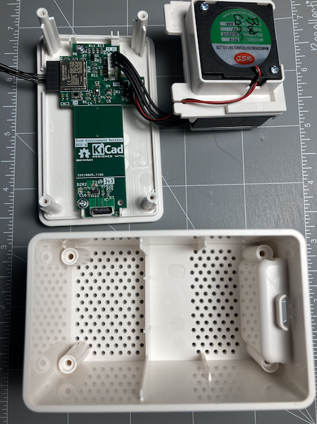
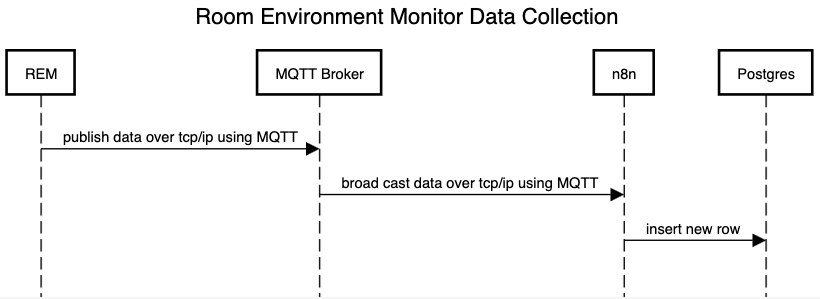
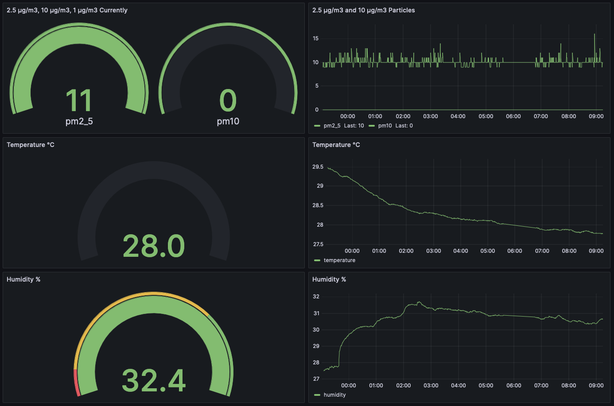

# Overview 

The Room Environment Monitor (REM) project was something that I started back in 2017. I wanted a small IoT device that could tell me if there was a concerning amount of volatile organic compounds (VOCs) and CO2 in my workshop. I built the first version based on a Raspberry Pi Zero and CCS811 sensor. I went through multiple iterations of the project with the overall objective to reduce cost. At that time CCS811s cost about 40 dollars alone bringing the total bill of materials to about 70 CAD. Fast forward a few years later and IKEA released their Vindriktning monitor which uses a PM1006 sensor to measure 2.5um matter in the air. I designed my latest version of the Room Environment Monitor to replace the controller inside and make use of the device's case.

# Data Collection

The REM collects data from the following sensors:
1. [BME280](https://www.bosch-sensortec.com/products/environmental-sensors/humidity-sensors-bme280/) - Temperature, Humidity, Pressure
1. [SGP40-2.5k](https://sensirion.com/products/catalog/SGP40) - VOCs, C02  
1. [PM1006K](https://en.gassensor.com.cn/ParticulateMatterSensor/info_itemid_105.html) - particulate matter in the air (2.5ug/m^3, 1.0ug/m^3, 10ug/m^3)

This data is then "published" using MQTT to a MQTT broker. The broker then broadcasts the data to any subscribers. I use [n8n](https://n8n.io/) which is a workflow automation tool to subscribe to the REM data stream. n8n ensures that each piece of data in this stream is inserted as a new row in to a Postgres database. Bellow is a sequence diagram that shows how the data flows and is collected. 

<!-- https://sequencediagram.org/
title Room Environment Monitor Data Collection 

REM->MQTT Broker:publish data over tcp/ip using MQTT
MQTT Broker->n8n:broad cast data over tcp/ip using MQTT 
n8n->Postgres: insert new row  -->

<!-- # Data Visualization -->

I use Grafana, a free an open source tool to visualize the collected data in my Postgres database. Here is a screenshot of the dashboard that I have created to visualize the data.

