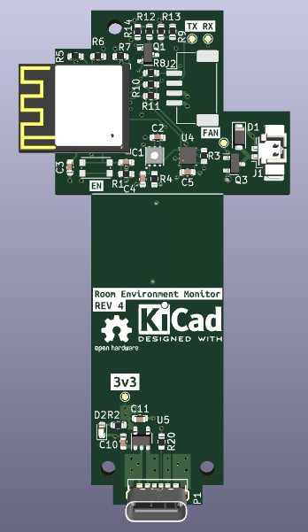

# Overview 

The Room Environment Monitor project was something that I started back in 2017. I wanted a small IoT device that could tell me if there was a concerning amount of volatile organic compounds (VOCs) and CO2 in my workshop. I built the first version based on a Raspberry Pi Zero and CCS811 sensor. I went through multiple iterations of the project with the overall objective to reduce cost. At that time CCS811s cost about 40 dollars alone bringing the total bill of materials to about 70 CAD. Fast forward a few years later and IKEA released their Vindriktning monitor which uses a PM1006 sensor to measure 2.5um matter in the air. I designed my latest version of the Room Environment Monitor to replace the controller inside and make use of the device's case.