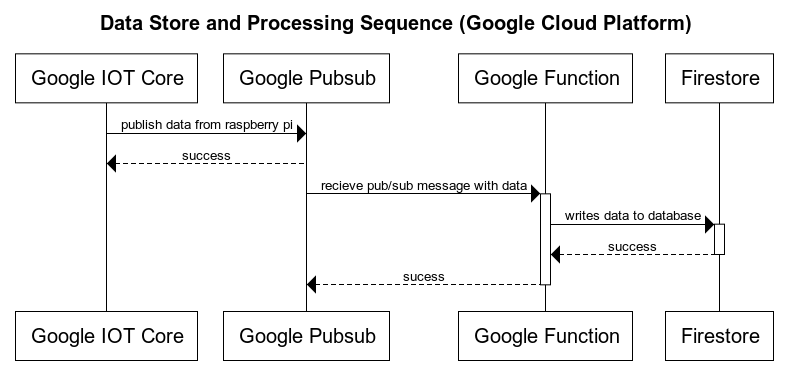

# Overview 

The idea for this project came from my concern about the lack of ventilation in the room that I solder electronics in. I wanted to be able to monitor the total concentration of total volatile organic compounds (TVOCs) in the room and compare it to that of a different room which should not have any harmful chemicals in the air. 

## Operation and Sequences

I have a few diagrams that show the two many sequence of operations that happen to collect, transmit and store data. Note that the technologies that I am using to do this are a raspberry pi and the google cloud platform. The first diagram is the operations the raspberry pi performs. The second is what happens in the gcloud platform. 

# Building Locally
`GOARM=6 GOARCH=arm GOOS=linux go build main.go`
